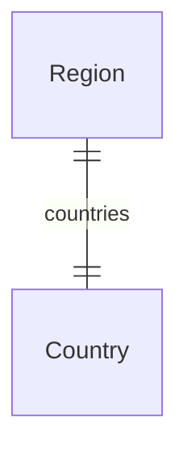

This documentation provides a reference to the data models in the Region Module

## Relations Overview

## Data Models

- [Country](/resources/references/region/models/Country)
- [Region](/resources/references/region/models/Region)
