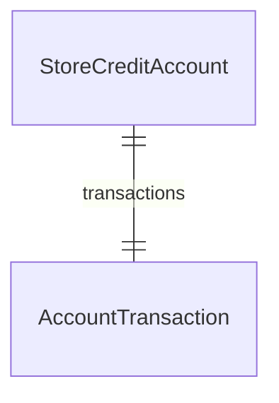

This documentation provides a reference to the data models in the Store Credit Module

## Relations Overview

## Data Models

- [AccountTransaction](/resources/references/store-credit/models/AccountTransaction)
- [StoreCreditAccount](/resources/references/store-credit/models/StoreCreditAccount)
