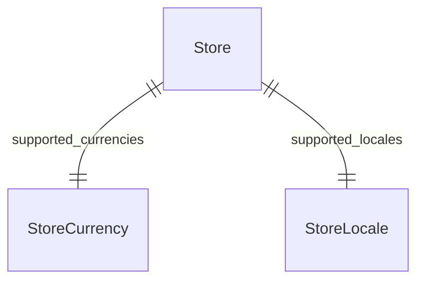

This documentation provides a reference to the data models in the Store Module

## Relations Overview

## Data Models

- [Store](/resources/references/store/models/Store)
- [StoreCurrency](/resources/references/store/models/StoreCurrency)
- [StoreLocale](/resources/references/store/models/StoreLocale)
