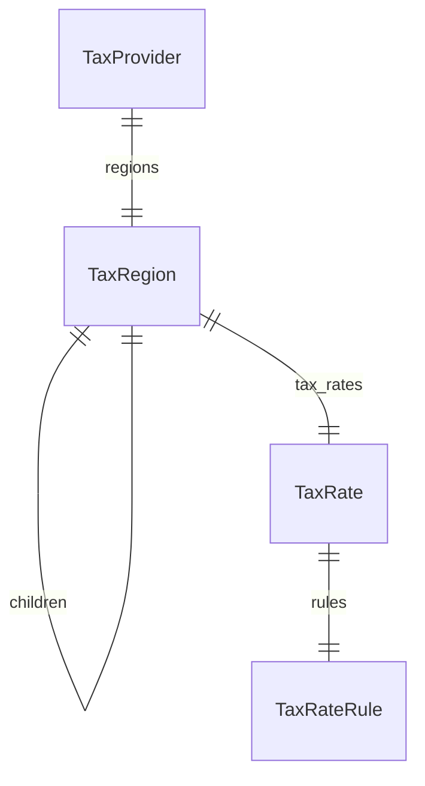

This documentation provides a reference to the data models in the Tax Module

## Relations Overview

## Data Models

- [TaxProvider](/resources/references/tax/models/TaxProvider)
- [TaxRate](/resources/references/tax/models/TaxRate)
- [TaxRateRule](/resources/references/tax/models/TaxRateRule)
- [TaxRegion](/resources/references/tax/models/TaxRegion)
